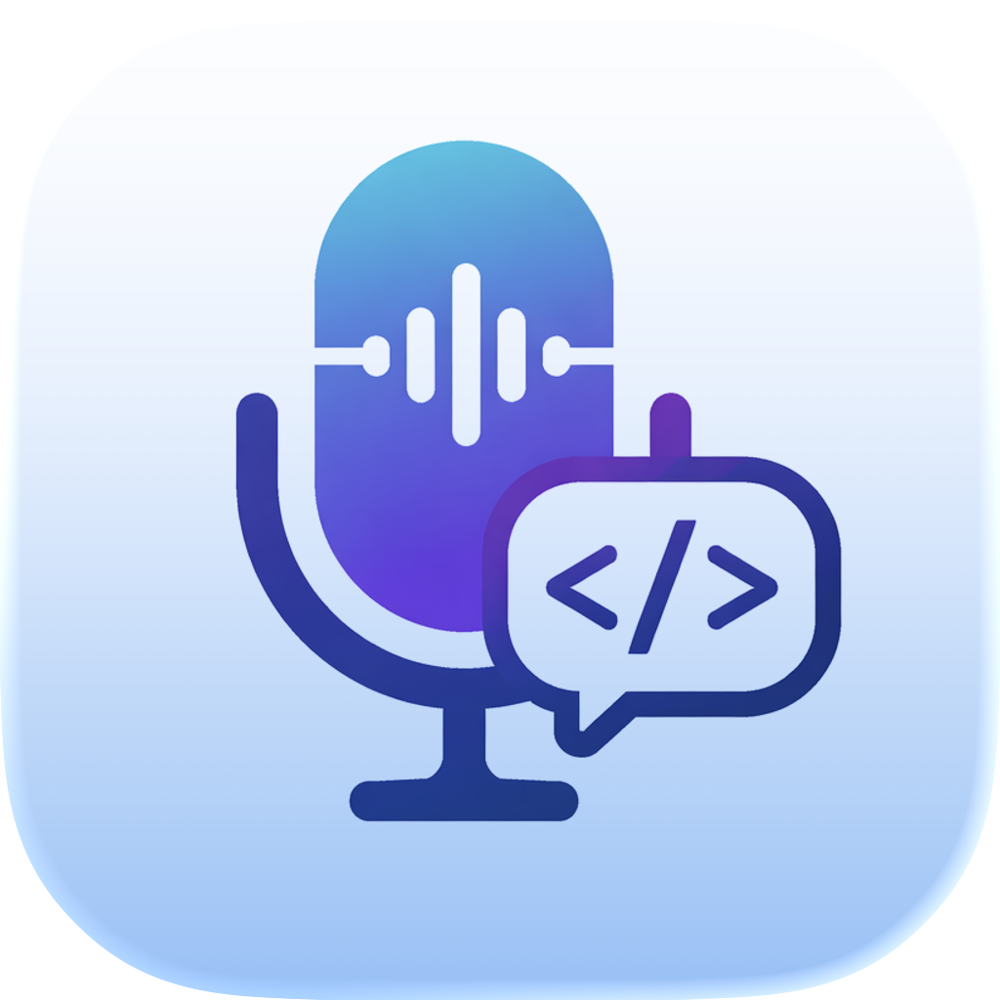
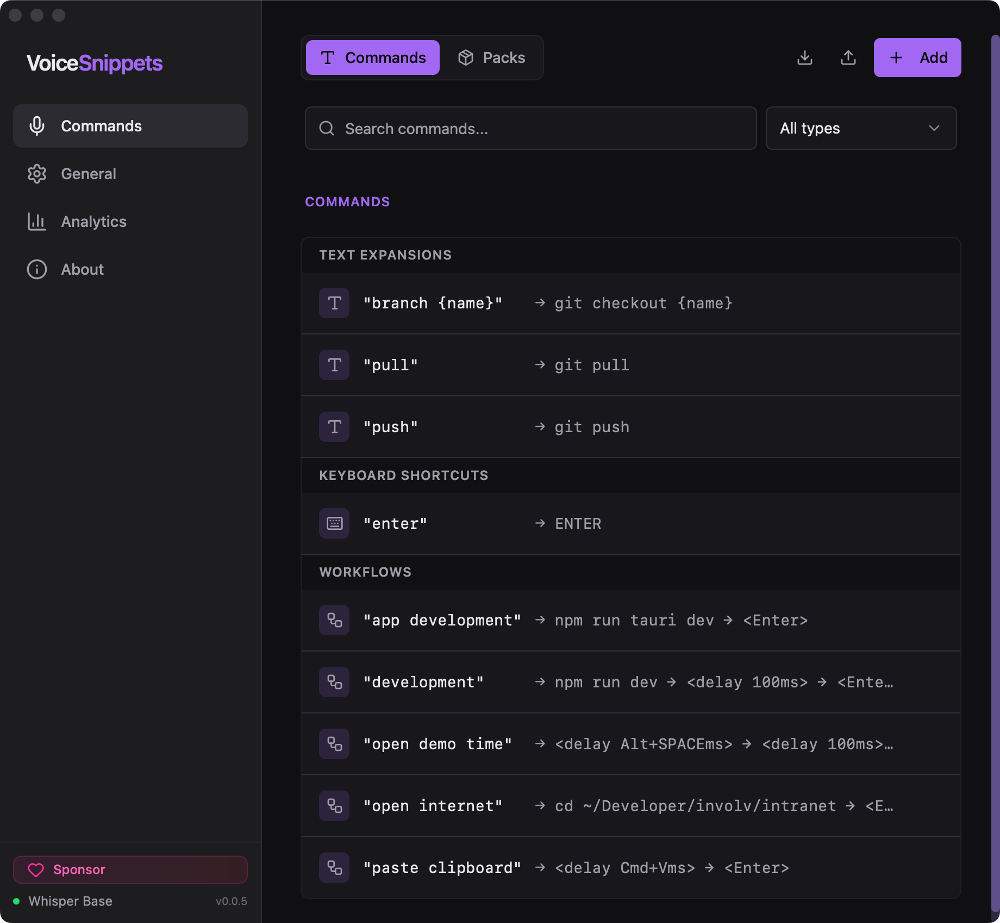
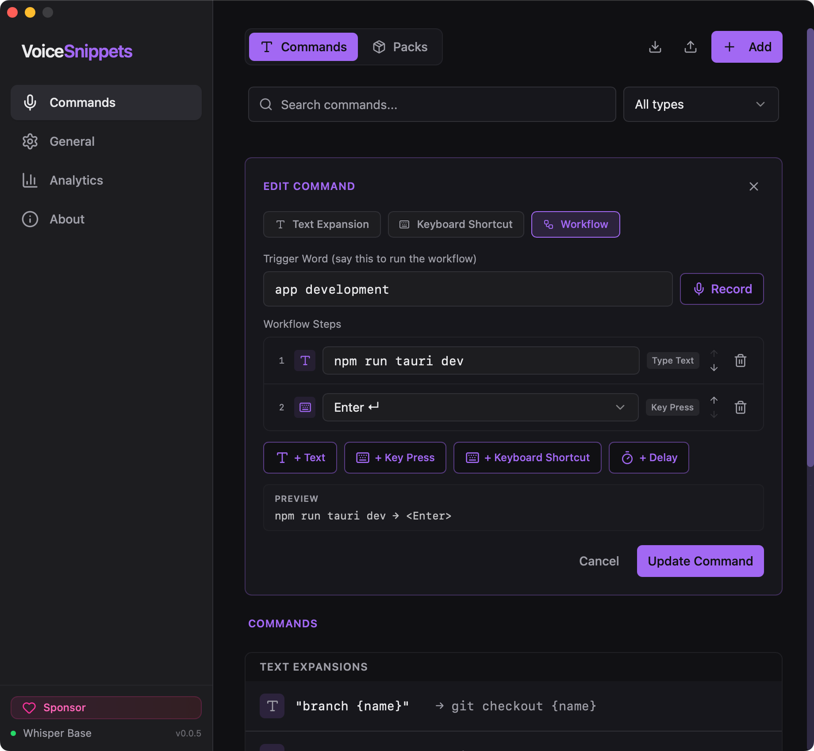
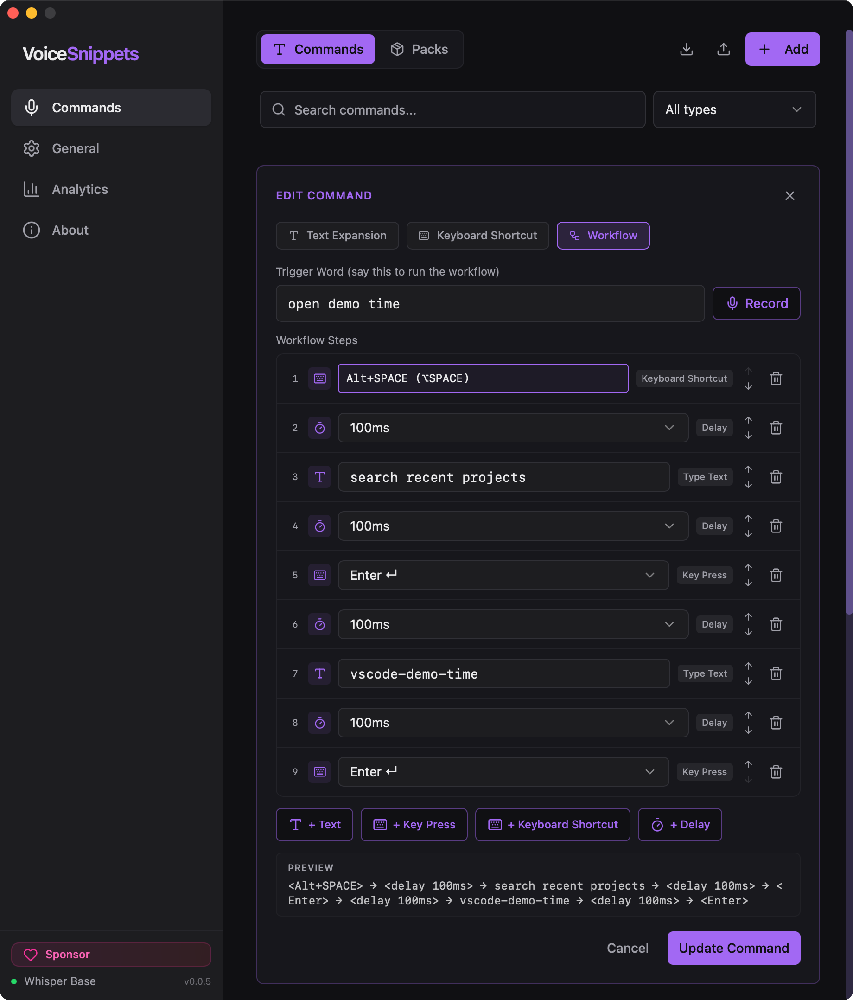
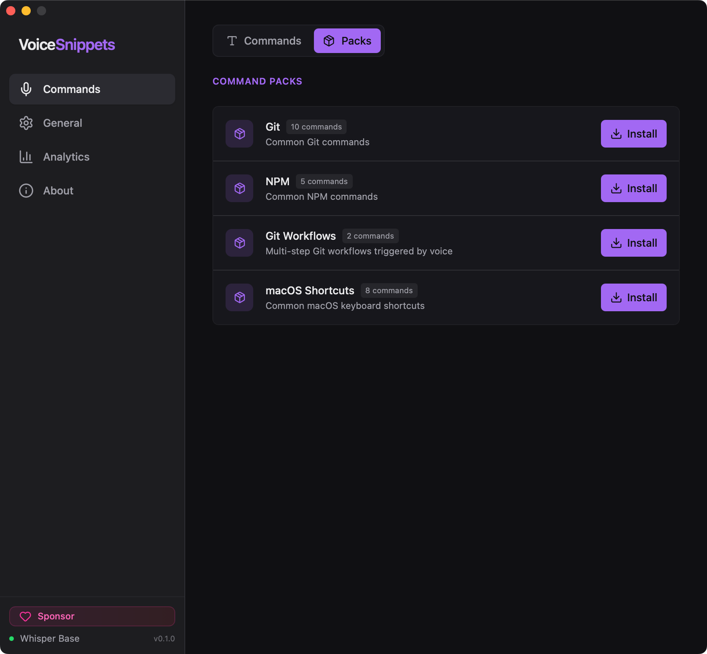
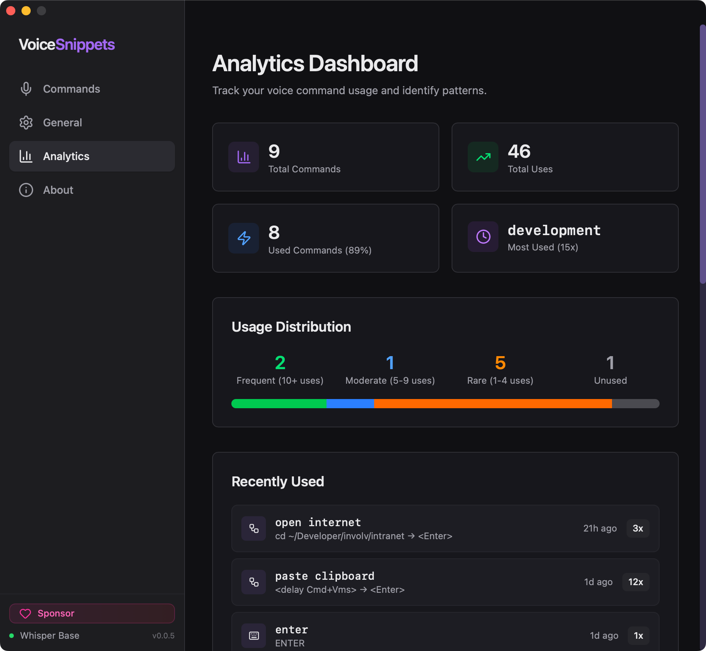

  

# VoiceSnippets

A cross-platform desktop application that uses voice commands to expand text snippets, execute keyboard shortcuts, and run workflows. Say a trigger word, get instant text expansion or automation.

  

## About

VoiceSnippets is a powerful voice-activated productivity tool that allows you to:

- **Expand text snippets** using voice commands
- **Execute keyboard shortcuts** hands-free
- **Run custom workflows** with simple voice triggers
- **Command packs** that you can easily import to get started quickly
- **Import and export** your voice commands for easy backup and sharing
- **Cross-platform support** for seamless productivity across devices (*WIP*)

Simply speak your trigger word, and **VoiceSnippets** instantly performs your configured action. Whether it's inserting a code snippet, executing a shortcut, or automating a complex workflow.

## Getting Started

- **Download** the latest release for your platform from the [Releases](../../releases) section.
- **Install** and **activate** a Whisper model in the General settings.
- **Add voice commands** in the Commands tab.
- **Press the global hotkey** (default: `⌥+S`) to start listening.
- **Speak your trigger word** and watch as VoiceSnippets performs the configured action!

## Examples of Voice Commands

VoiceSnippets allows you to configure custom voice commands to perform various actions like inserting text snippets, executing keyboard shortcuts, or running complex workflows. Here are some examples of what you can do with VoiceSnippets:

### Text expansion

- Say `Insert greeting` to expand a text snippet like "Hello, how are you?"
- Say `pull` to expand a text snippet like `git pull` in your terminal.

## Keyboard shortcuts

- Say `Enter` to execute the `Enter` keyboard shortcut hands-free.

  

> Once you start using it, you become lazy to type on your keyboard.

- Say `copy` to execute the `Cmd + C` (or `Ctrl + C`) keyboard shortcut to copy selected text.

## Workflows

- Say `app development` to run a workflow that expands text like `npm run tauri dev` and presses `Enter` to execute it in the terminal.

  

- Say `open demo time` to run a multistep workflow that opens the Visual Studio Code project via Raycast

  

## Features

### Command Packs

  

### Analytics

  

> This feature is only local, no data is sent to any server.

## Releases

All official releases of VoiceSnippets are published in this repository. You can find the latest version and download links in the [Releases](../../releases) section.

To get started, head over to the [latest release](../../releases/latest) and download the version for your platform.

## Issues & Feedback

This repository is the official place to:

- **Report bugs** or issues you encounter
- **Request new features** or enhancements
- **Provide feedback** on your experience with VoiceSnippets
- **Ask questions** about usage or configuration

Please [open an issue](../../issues/new) if you have any problems, suggestions, or feedback. Your input helps make VoiceSnippets better for everyone!

## Debugging

Under the **about** tab, you can find the log and application directory.

  

### Logs

In the log directory, you can find the logs from the application. You will also find the transcribed text, that way you can check if what you speak, is also transcribed.

> **Hint**: In some cases, it can be that the transcription is off; for that, you can lower the `Fuzzy Match Threshold` under the **General** tab.

### Application directory

In this directory, you can find the Whisper model, settings, and stored commands. In case you have the `Debug: Save Recordings` option turned on, you will find these recordings in the **recordings** folder of the application directory.

## Questions?

> Will VoiceSnippets become open source?

Yes! The plan is to open source the project after the beta is over.

> Does it use any cloud services?

No, VoiceSnippets runs entirely on your local machine. All voice processing and command execution happen locally, ensuring your data stays private and secure.

> Can I contribute to the project?

Absolutely! Once the project is open sourced, contributions will be welcome. You can help by reporting issues, suggesting features, or submitting pull requests with improvements.

  

