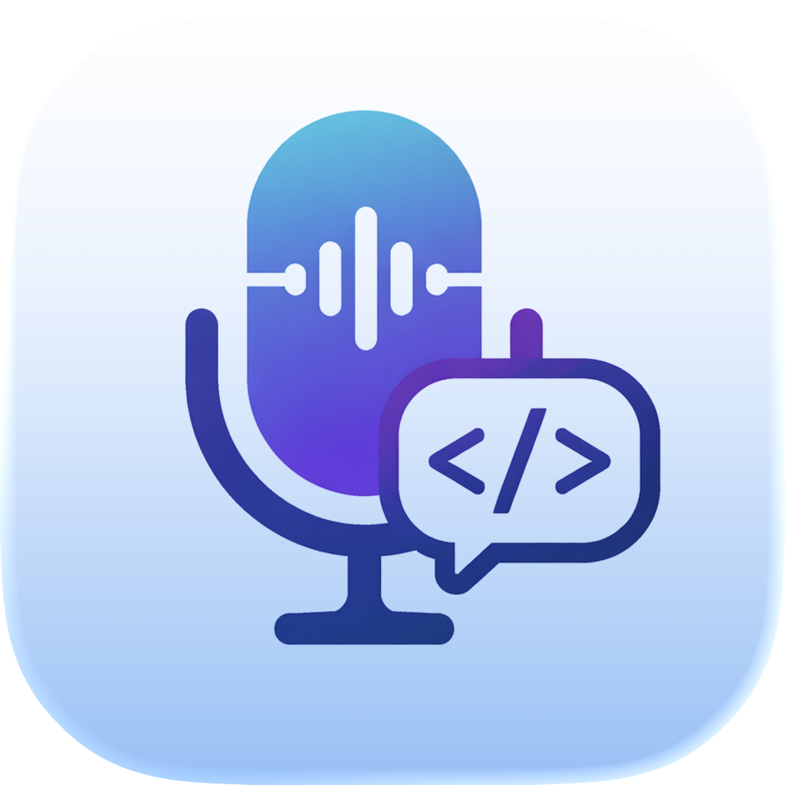
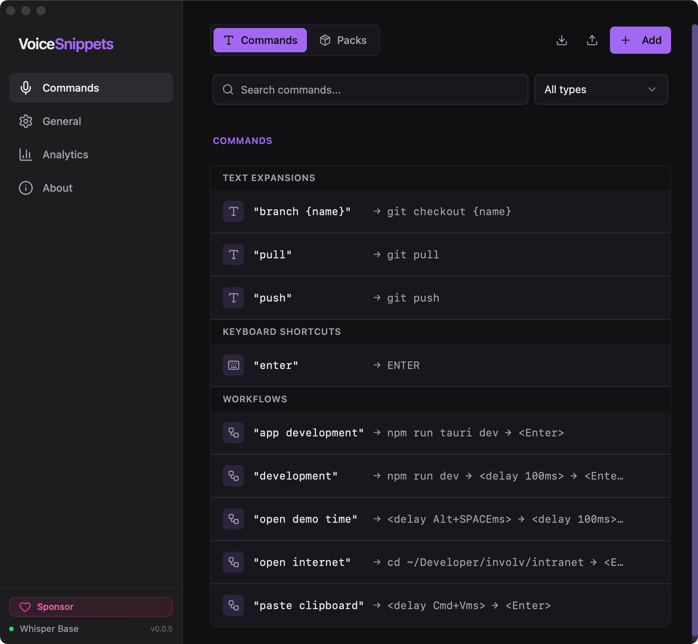
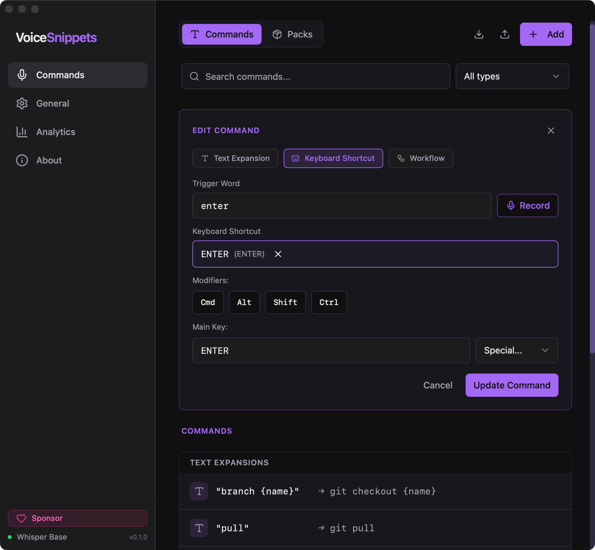
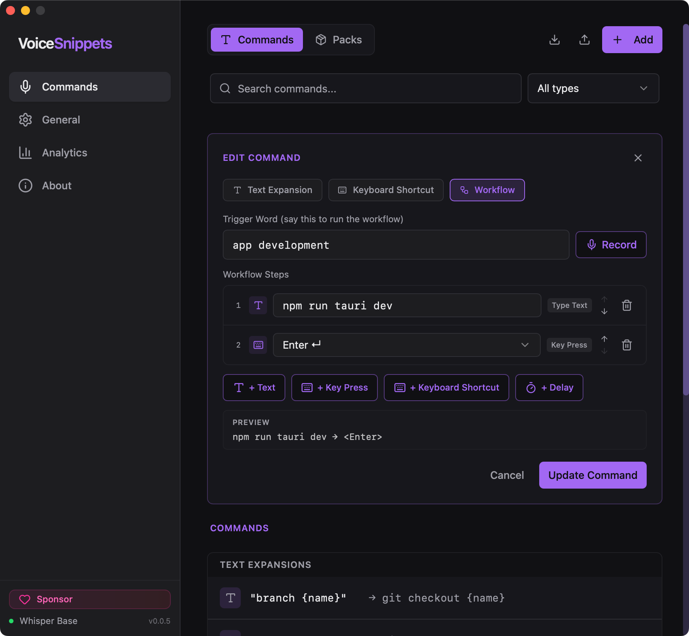
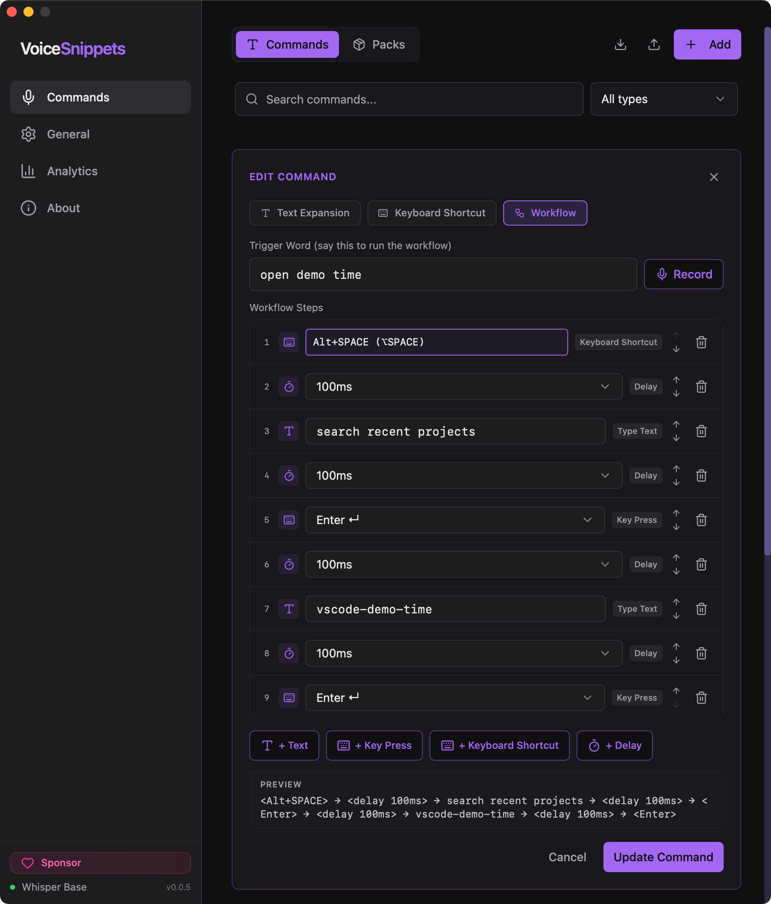
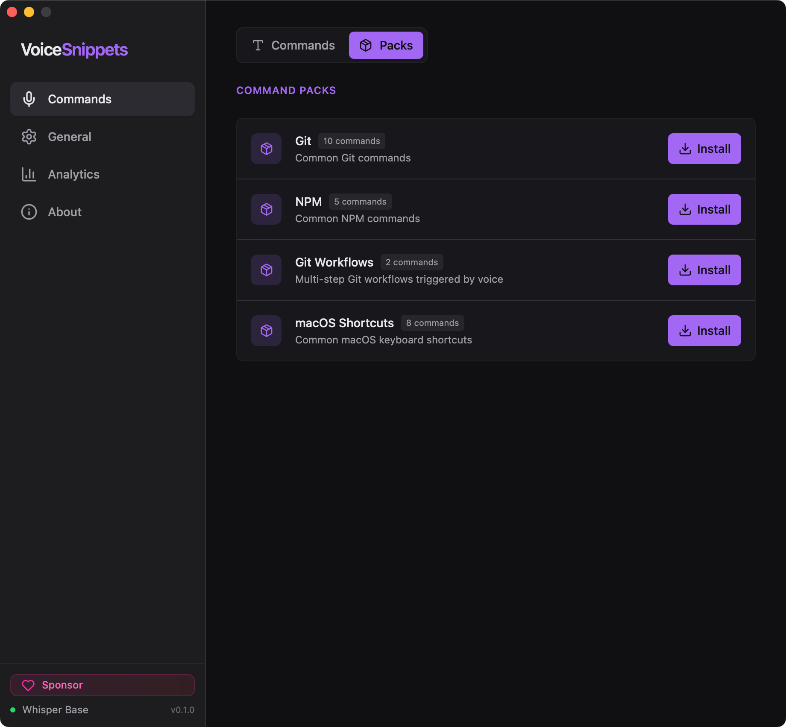
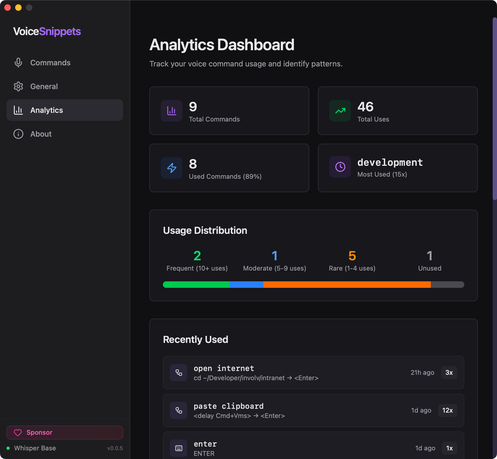

  

# VoiceSnippets

A cross-platform desktop application that uses voice commands to expand text snippets, execute keyboard shortcuts, and run workflows. Say a trigger word, get instant text expansion or automation.

  

## About

VoiceSnippets is a powerful voice-activated productivity tool that allows you to:

- **Text Expansion**: Map trigger words to text snippets (e.g., say "email" → expands to your email)
- **Keyboard Shortcuts**: Execute keyboard shortcuts by voice hands-free (e.g., say "save" → Cmd+S)
- **Workflows**: Chain multiple actions—type text, press keys, add delays to automate complex tasks
- **Command Aliases**: Define multiple trigger phrases for a single command
- **Command Chaining**: Trigger multiple commands in a single breath using conjunctions like "and", "then", or "and then"
- **App-Aware Commands**: Specify which commands apply to which apps for context-specific actions
- **Custom Word Remapping**: Correct commonly misheard words during transcription
- **Cloud Sync**: Sync commands to GitHub Gist for backup and cross-device synchronization
- **Command Packs**: Pre-built packs for common tools to get started quickly
- **Voice Activity Detection**: Automatically stops recording when silence is detected
- **Menu Bar Integration**: Minimalist design—lives in your menu bar, out of the way
- **Analytics**: Track your command usage statistics (local only, no data sent anywhere)

Simply speak your trigger word, and **VoiceSnippets** instantly performs your configured action. Whether it's inserting a code snippet, executing a shortcut, or automating a complex workflow.

## Getting Started

- **Download** the latest release for your platform from the [Releases](../../releases) section.
- **Install** and **activate** a Whisper model in the General settings.
- **Add voice commands** in the Commands tab.
- **Press the global hotkey** (default: `⌥+S`) to start listening.
- **Speak your trigger word** and watch as VoiceSnippets performs the configured action!

You can customize the hotkey in Settings.

## Command Types

### Text Expansion

Say a trigger word to expand it into text:

- Trigger: `"email"` → Expansion: `"user@example.com"`
- Say `Insert greeting` to expand a text snippet like "Hello, how are you?"
- Say `pull` to expand a text snippet like `git pull` in your terminal.

### Keyboard Shortcuts

Execute a keyboard shortcut by voice:

- Trigger: `"save"` → Expansion: `"Cmd+S"`
- Say `copy` to execute the `Cmd + C` (or `Ctrl + C`) keyboard shortcut to copy selected text.
- Say `Enter` to execute the `Enter` keyboard shortcut hands-free.

  

> Once you start using it, you become lazy to type on your keyboard.

### Workflows

Chain multiple actions—type text, press keys, add delays:

- Trigger: `"app development"` → Steps: `npm run tauri dev` → Enter
- Trigger: `"commit changes {message}"` → Steps: `git add .` → Enter → `git commit -m "{message}"` → Enter
- Say `open demo time` to run a multistep workflow that opens the Visual Studio Code project via Raycast

  

  

## Command Chaining

Trigger multiple commands in a single breath by using conjunctions like **"and"**, **"then"**, or **"and then"** between commands.

- Say `"clear terminal and dev"` → runs the "clear terminal" command, then the "dev" command
- Say `"new file then save"` → runs the "new file" command, then the "save" command
- Say `"copy and then paste"` → runs the "copy" command, then the "paste" command

> Chaining only activates when **all** segments match a known command. If any part doesn't match, the full transcription is treated as a single command instead. You can enable or disable this feature in **Settings → Preferences → Command Chaining**.

## Features

### Command Packs

Pre-built packs for common tools to get you started quickly:

- **Git**: Common git commands (status, pull, push, commit, etc.)
- **npm**: Node.js scripts (dev, build, test, start, lint)
- **Git Workflows**: Multi-step git workflows
- **macOS Shortcuts**: Common system shortcuts

Install/uninstall packs from the Packs tab. Commands are tagged with the pack name for easy management.

  

### Analytics

Track your command usage statistics directly in the app. Perfect for understanding which voice commands you use most.

  

> This feature is only local—no data is sent to any server. Your usage statistics stay completely private.

## Platform Support

- **macOS**: Full support (Metal acceleration, menu bar, accessibility permissions)
- **Windows**: Full support (Vulkan acceleration, code signing)

## Releases

All official releases of VoiceSnippets are published in this repository. You can find the latest version and download links in the [Releases](../../releases) section.

To get started, head over to the [latest release](../../releases/latest) and download the version for your platform.

## Issues & Feedback

This repository is the official place to:

- **Report bugs** or issues you encounter
- **Request new features** or enhancements
- **Provide feedback** on your experience with VoiceSnippets
- **Ask questions** about usage or configuration

Please [open an issue](../../issues/new) if you have any problems, suggestions, or feedback. Your input helps make VoiceSnippets better for everyone!

## Debugging

Under the **about** tab, you can find the log and application directory.

  

### Logs

In the log directory, you can find the logs from the application. You will also find the transcribed text, that way you can check if what you speak, is also transcribed.

> **Hint**: In some cases, it can be that the transcription is off; for that, you can lower the `Fuzzy Match Threshold` under the **General** tab.

### Application directory

In this directory, you can find the Whisper model, settings, and stored commands. In case you have the `Debug: Save Recordings` option turned on, you will find these recordings in the **recordings** folder of the application directory.

## Questions?

> Will VoiceSnippets become open source?

Yes! The plan is to open source the project after the beta is over.

> Does it use any cloud services?

No, VoiceSnippets runs entirely on your local machine. All voice processing and command execution happen locally, ensuring your data stays private and secure.

> Can I contribute to the project?

Absolutely! Once the project is open sourced, contributions will be welcome. You can help by reporting issues, suggesting features, or submitting pull requests with improvements.

  

